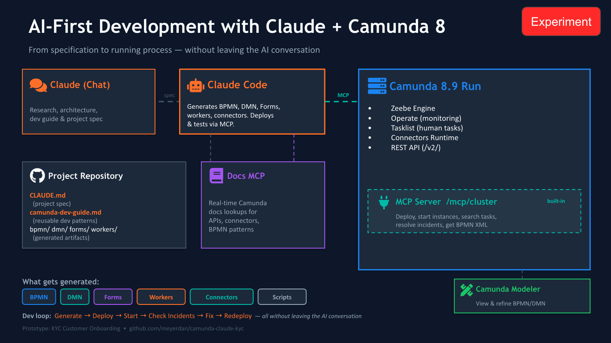
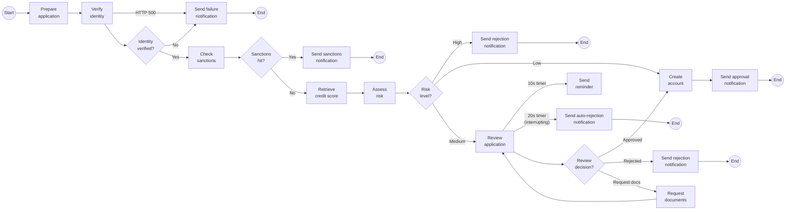

# KYC Customer Onboarding — AI-Generated Camunda 8 Application

## What This Is

This is an experiment in AI-first development with Camunda 8. The entire application — BPMN process, DMN decision table, Camunda Forms, Node.js job workers, mock API server, deployment scripts — was generated by [Claude Code](https://docs.anthropic.com/en/docs/claude-code) from a natural language specification. No code was written by hand.

The goal: test whether an AI coding agent can act as a full-stack Camunda developer, producing a deployable process application from a spec file alone.

## The Setup



Two-stage workflow: **Claude Chat** researches Camunda 8 patterns (via the Docs MCP server) and produces the project spec (`CLAUDE.md`) and a reusable dev guide (`camunda-dev-guide.md`). **Claude Code** then reads both files, generates all artifacts, and deploys them — without leaving the AI conversation.

Key detail: deployment goes through the REST API (`POST /v2/deployments`), not MCP. The MCP server is used for starting instances, searching tasks and incidents, resolving incidents, and retrieving BPMN XML.

## The KYC Process

A Know Your Customer onboarding flow that takes a customer application through identity verification, sanctions screening, credit scoring, risk assessment, and (when needed) manual compliance review.



**Paths:**
- **Happy path (Low risk):** Prepare → ID check passes → No sanctions → Credit score → DMN = LOW → Create account → Notify approved
- **Medium risk → Manual review:** DMN = MEDIUM → Compliance review form in Tasklist → Approve, reject, or request additional documents (loops back)
- **High risk:** DMN = HIGH → Auto-reject
- **Sanctions hit:** Name on sanctions list → Immediate block
- **ID verification failure:** Document not recognized or service HTTP 500 → Error boundary catches connector failure → Notify and end
- **Review timeout:** Non-interrupting timer fires reminder at 10s; interrupting timer auto-rejects at 20s

## Application Structure

```
kyc-onboarding/
├── CLAUDE.md                              # Project spec — what to build
├── docs/
│   ├── camunda-dev-guide.md               # Reusable Camunda 8 dev patterns
│   └── bpmn-modeling-best-practices.md    # BPMN naming/layout reference
│
├── bpmn/
│   └── kyc-onboarding.bpmn               # Main process (REST connectors, DMN call,
│                                          #   user tasks, timer events, error boundary)
├── dmn/
│   └── risk-assessment.dmn               # Decision table: identityScore × creditScore
│                                          #   × country → LOW / MEDIUM / HIGH
├── forms/
│   ├── review-application.form           # Compliance review: read-only context +
│   │                                      #   decision dropdown + comments
│   └── request-documents.form            # Document request: what docs are needed
│
├── mock-server/
│   ├── package.json
│   └── server.js                         # Express on :3001, three endpoints:
│                                          #   /api/identity-verify   (FAIL*/ERROR* prefixes)
│                                          #   /api/sanctions-check   (SANCTIONED in name)
│                                          #   /api/credit-score      (deterministic hash)
│
├── workers/
│   ├── package.json
│   ├── tsconfig.json
│   └── src/
│       ├── index.ts                      # Registers all workers with Zeebe gRPC
│       └── handlers/
│           ├── prepare-application.ts    # Validates fields, generates applicationId
│           ├── send-notification.ts      # Logs notification (all types)
│           └── create-account.ts         # Generates accountId
│
├── scripts/
│   ├── deploy.sh                         # curl → POST /v2/deployments
│   ├── start-happy.sh                    # Alice Johnson, US, low risk
│   ├── start-medium-risk.sh              # Bob Martinez, BR, medium risk
│   ├── start-sanctions.sh                # SANCTIONED Person, blocked
│   └── start-error.sh                    # Frank Error, HTTP 500
│
└── viewer/
    ├── serve.js                          # Static file server for BPMN viewer
    └── index.html                        # bpmn-js based visual inspector
```

## Running It

### Prerequisites

- [Camunda 8.9 Run](https://docs.camunda.io/docs/self-managed/setup/deploy/local/c8run/) running on `localhost:8080`
- Node.js 18+
- `jq` (for script output formatting)

### 1. Start the mock server

```bash
cd mock-server && npm install && npm start
```

Runs on `http://localhost:3001`. Keep it running.

### 2. Deploy all resources

```bash
bash scripts/deploy.sh
```

Deploys the BPMN process, DMN decision table, and both forms in a single atomic deployment.

### 3. Start the workers

```bash
cd workers && npm install && npm start
```

Connects to Zeebe gRPC on `localhost:26500`. Registers handlers for `prepare-application`, `send-notification`, and `create-account` task types. Keep it running.

### 4. Run a test scenario

```bash
bash scripts/start-happy.sh      # Low risk → auto-approved
bash scripts/start-medium-risk.sh # Medium risk → waiting in Tasklist
bash scripts/start-sanctions.sh   # Sanctions hit → blocked
bash scripts/start-error.sh       # HTTP 500 → error boundary
```

### 5. Check results

- **Operate** at `http://localhost:8080/operate` — see completed/active instances
- **Tasklist** at `http://localhost:8080/tasklist` — complete the compliance review form for medium-risk instances

## Test Scenarios

| Scenario | Script | Key Input | Expected Outcome |
|---|---|---|---|
| **Happy path** | `start-happy.sh` | Alice Johnson, US, `AB123456` | ID ✓ → Sanctions ✓ → Credit → LOW → Account created → Approved |
| **Medium risk** | `start-medium-risk.sh` | Bob Martinez, BR, `BR789012` | → MEDIUM → Waiting at Review task in Tasklist |
| **Sanctions hit** | `start-sanctions.sh` | SANCTIONED Person, US | → Sanctions hit → Blocked |
| **Service error** | `start-error.sh` | Frank Error, `ERROR500` | → HTTP 500 → Error boundary → Verification failed |
| **ID verification fail** | *(manual)* | Any name, `FAIL999` | → `verified: false` → Verification failed |
| **Medium → reject** | *(Tasklist)* | Complete review with "Reject" | → Rejection notification → End |
| **Medium → request docs** | *(Tasklist)* | Complete review with "Request Documents" | → Document request form → Loops back to review |

Input conventions are deterministic: `FAIL*` prefix fails ID check, `ERROR*` prefix triggers HTTP 500, `SANCTIONED` in the name triggers a sanctions hit, country outside `US/GB/DE/FR` with good scores yields MEDIUM risk.

## The Two-File Pattern

The key architectural insight is separating **how to build on Camunda** from **what to build**.

**`docs/camunda-dev-guide.md`** — the reusable knowledge layer. It teaches the AI how to generate BPMN XML, configure REST connectors, write Zeebe workers, create DMN decision tables, build Camunda Forms, deploy via REST, and monitor via MCP. This file is Camunda-specific but project-agnostic. Drop it into any new project.

**`CLAUDE.md`** — the project spec. It describes the KYC process flow, decision logic, API contracts, variable mappings, form fields, error handling, and test scenarios. It references patterns from the dev guide but contains only project-specific decisions.

This separation means:
- The dev guide accumulates institutional knowledge about Camunda 8 development
- New projects only need a new `CLAUDE.md` — the AI already knows the platform
- The spec is auditable — you can review exactly what the AI was asked to build
- Both files evolve independently: update the dev guide when Camunda changes, update the spec when requirements change
